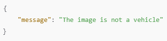
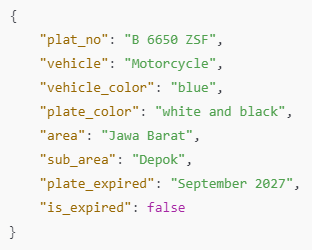
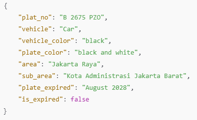

# Plate Number Detection Program

## Overview
This project is designed to detect and extract information from vehicle license plates in Indonesia. By providing an image as input, the program identifies the license plate, analyzes its components, and returns a detailed JSON response containing relevant information such as the plate number, vehicle type, area of registration, and expiration status.

## Features
* Detects Indonesian license plates from images.
* Extracts detailed information based on the plate's format and regulations.
* Returns the data in a structured JSON format.
* Handles cases where the image does not contain a vehicle.

## Requirements
* Python 3.7 or higher
* Libraries:
  * ```google-generativeai```
  * ```Pillow```
  * ```dotenv```

## Setup

1. Install Required Libraries
Run the following command to install dependencies:
```pip install -q -U google-generativeai python-dotenv```

2. Configure the Environment
Google Colab
* In the Initialization section, choose the Run in Google Colab option.
* Set the API key in secrets.
Local Environment
* Rename the ```.env.example``` file to ```.env```.
* Insert your ```API key``` into the ```.env``` file.

## Usage
Steps to Run the Notebook:
1. Install dependencies using the command provided in the setup section.
2. Initialize the environment (either in Colab or locally).
3. Select the image: In the Load File section, choose the image to analyze by modifying the ```detection``` variable.
4. Run the detection by executing the remaining notebook cells.
5. View the JSON response for the plate detection.

## JSON Response
Successful Detection
The JSON response includes the following fields:
- plat_no: The license plate number.
- vehicle_type: The category or type of vehicle.
- vehicle_color: The color of the vehicle.
- plate_color: The background and foreground colors of the license plate.
- area: The region corresponding to the prefix, based on the Indonesian license plate format (refer to Regulation of the Chief of the Indonesian National Police Number 7 of 2021).
- sub_area: The sub-region determined by the combination of the prefix and postfix, following the same regulation.
- plate_expired: The expiration date of the license plate.
- is_expired: A boolean value (true/false) indicating whether the plate has expired, based on the current date and the expiration date.

Sample Response:
```json
{
    "plat_no": "D 3245 ZYX",
    "vehicle": "Motorcycle",
    "vehicle_color": "red",
    "plate_color": "black and white",
    "area": "Bandung",
    "sub_area": "Bandung Barat",
    "plate_expired": "March 2026",
    "is_expired": false,
    "gate_open": "07:00 AM",
    "gate_closed": "08:00 PM"
}
```

## When No Vehicle is Detected
If no vehicle is found in the image, the following response is returned:
```json
{
    "message": "The image does not contain vehicle",
}
```

## Example
### 1 - Shoe
Input:


Output:



### 2 - Motorcycle
Input:


Output:



### 3 - Car
Input:


Output:

